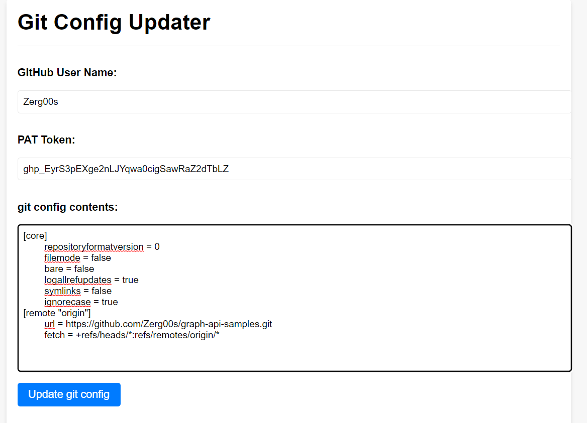

# Git Config Updater Web App

## 👉 [Open config modifier](https://zerg00s.github.io/git-config-modifier/)

A user-friendly web application that allows users to easily update their git config contents with their GitHub username and Personal Access Token (PAT). The app stores and retrieves the user's GitHub username and PAT in cookies, enabling a seamless experience on return visits. The clean, modern design ensures an enjoyable user experience while managing git configurations.

## Features

- Input fields for GitHub username, PAT, and git config contents
- Automatically updates the git config URL with the provided username and PAT
- Stores and retrieves the GitHub username and PAT using cookies for convenience
- Responsive design that works well on both desktop and mobile devices
- Easy-to-use interface with clear instructions and labels

## Usage
1. Clone the repository or download the source files.
1. Open index.html in your preferred web browser.
1. Enter your GitHub username, PAT, and current git config contents.
1. Click the "Update git config" button to generate updated git config contents.
1. Copy the updated git config contents and use them as needed 